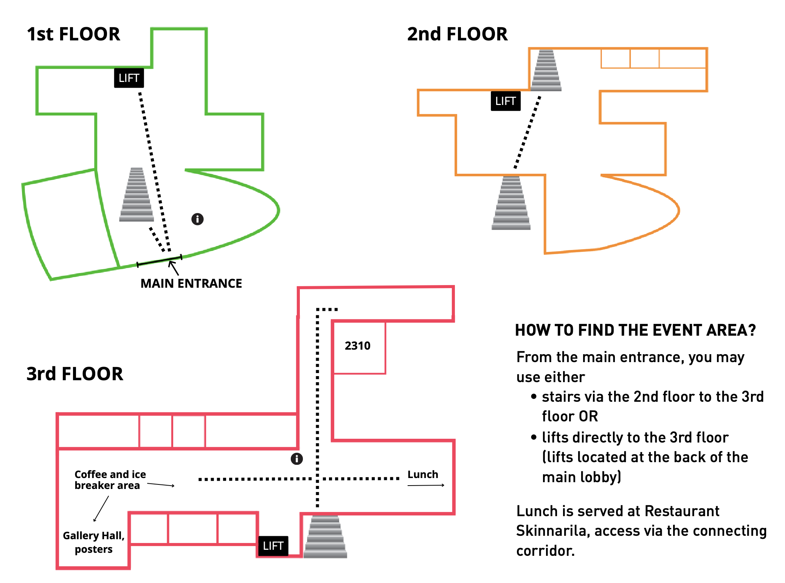

## **Venue**

ProbNum 2026 will take place at the **Lappeenranta Campus of LUT University** (Yliopistonkatu 34, 53850 Lappeenranta). The campus is situated in Lappeenranta in Eastern Finland by Lake Saimaa.

<iframe src="https://www.google.com/maps/embed?pb=!1m18!1m12!1m3!1d1930.342321661942!2d28.09175831348225!3d61.064999070797384!2m3!1f0!2f0!3f0!3m2!1i1024!2i768!4f13.1!3m3!1m2!1s0x469094f4435a9599%3A0x133e1ee3dcc2a5cd!2sLUT-yliopisto%2C%20Lappeenrannan%20kampus!5e0!3m2!1sfi!2sfi!4v1782300236184!5m2!1sfi!2sfi" width="600" height="450" style="border:0;" allowfullscreen="" loading="lazy" referrerpolicy="strict-origin-when-cross-origin"></iframe>

---

### How to reach Lappeenranta

- In most cases you should fly to **Helsinki Airport** and take a train from the airport to Lappeenranta. The train ride takes about 2 hours and involves a change from a local train to an intercity train in Tikkurila near Helsinki Airport.
- You must have a seat reservation. Book your tickets from Helsinki Airport to Lappeenranta before boarding the train at [VR.fi](https://www.vr.fi/en/single-ticket-outbound-search-results?from=LEN&to=LR).
- To reach the intercity transfer station in Tikkurila you should catch the local P train at the Helsinki Airport Station (Lentoasema). If you have not bought a ticket all the way from the airport to Lappeenranta, you need a local BC or CD ticket to reach Tikkurila. See [HSL.fi](https://reittiopas.hsl.fi/etusivu?locale=en) for more information.

---

### How to reach the conference venue

- The conference will take place at the Lappeenranta Campus of LUT University (Yliopistonkatu 34), about 7 km from central Lappeenranta where most hotels are located.
- **Bus line 5** operates between the railway station (<i>Matkakeskus</i>), city center (<i>Keskusta</i>) and the campus (<i>Yliopisto</i>). If you hop in to the bus from city centre, please use the bus stop <i>Keskusta L</i> on Koulukatu, near the shopping center Armada. The ride to the university from city center takes about 20 minutes, and from the railway station about 30 minutes. A single ticket costs &#8364;3.60. Tickets can be bought onboard with cash or card. [[Public Transport in Lappeenranta](https://lappeenranta.fi/en/public-transport)] [[Journey Planner](https://lappeenranta.digitransit.fi/?locale=en)]
- The walk from the railway station to city center takes about 20 minutes.

---

### How to navigate the conference venue

- All talks will take place in <b>lecture hall 2310</b>. 
- Coffee breaks, ice breaker and the poster session take place nearby on the same floor. 
- Lunch is server in Restaurant Skinnarila in a connected building of LAB University of Applied Sciences.
- On the morning of 9 September the registration desk ((marked <i>i</i> on the map) will be located next to the main entrance. Those arriving later may pick up their name tags from a desk located at the crossroad of Street Cafe in 3rd floor.
- We have a dedicated <b>WiFi network <i>ProbNum26</i></b>. No password is needed.

  

---

### Hotels

Hotels in Lappeenranta:
- [Original Sokos Hotel Lappee](https://www.sokoshotels.fi/en/hotels/lappeenranta/original-sokos-hotel-lappee): We have an allotment for the period 8&ndash;11 September 2026. Use the code **BPROBNUM26** to reserve your room by 18 August. Prices per night: &#8364;119 / 1 person standard &mdash; &#8364;139 / 2 persons standard &mdash; &#8364;159 / 1 person superior &mdash; &#8364;179 / 2 persons standard.
- [Hotelli Rakuuna](https://www.rakuunahotelli.fi/en/): We have an allotment for the period 8&ndash;11 September 2026. Reservations from this allotment must be made by 9 August 2026. The room price is &#8364;101/single room and &#8364;111/double room with the code **Probnum**. Reservations must be made directly with the hotel either by email info@rakuunahotelli.fi or by calling +358 10 340 2040. The room can be cancelled free of charge by 6 pm the day before arrival.
- [Scandic Patria](https://www.scandichotels.com/en/hotels/scandic-patria): Use the code **CCON** for a discount. [[Link with code](https://www.scandichotels.com/en?bookingCode=CCON)]
- [Hotelli Lähde](https://hotellilahde.fi/en/)

Somewhat cheaper options:
- [Gasthaus Kantolankulma](https://gasthauslappeenranta.com/?lang=en)
- [CitiMOTEL](https://www.citimotel.fi/en/home)

It is also possible to book small cottages (bed sheets not included):
- [Camping Lappeenranta](https://campinglappeenranta.fi/en/)

---

### Public saunas in Lappeenranta

- [Myllysaaren sauna](https://livelife.fi/sauna-avanto/) is located a short walk from Lappeenranta city center. [[Google Maps](https://maps.app.goo.gl/nAtUcECJHGGNgsME9)]
- [Traditional smoke sauna](https://www.saimaansaunaseura.fi/?page_id=16) in Hinkanranta about 25 km from Lappeenranta. [[Google Maps](https://maps.app.goo.gl/TbjBSXn2hfzdtXvh8)]
- [Hinkanrannan saunat](https://www.hinkanrannansaunat.fi/english) in Hinkanranta about 25 km from Lappeenranta. [[Google Maps](https://maps.app.goo.gl/TbjBSXn2hfzdtXvh8)]
- [Konstun majan sauna](https://www.piensaimaansaunojat.fi/) in Taipalsaari about 12 km from Lappeenranta. [[Google Maps](https://maps.app.goo.gl/o3tvAyz1fe6gawRk7/)]

---

 
 
